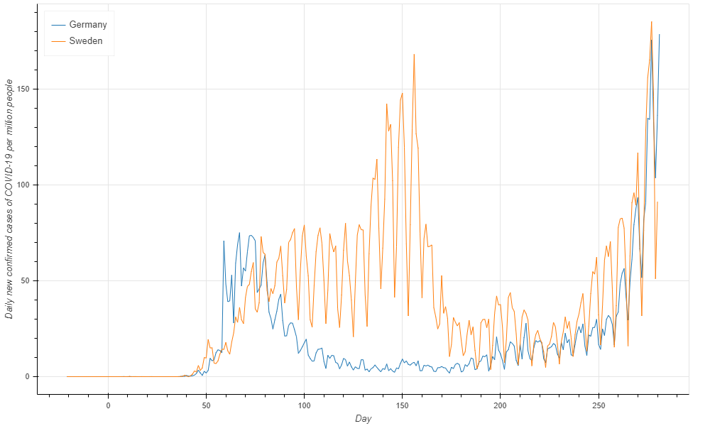
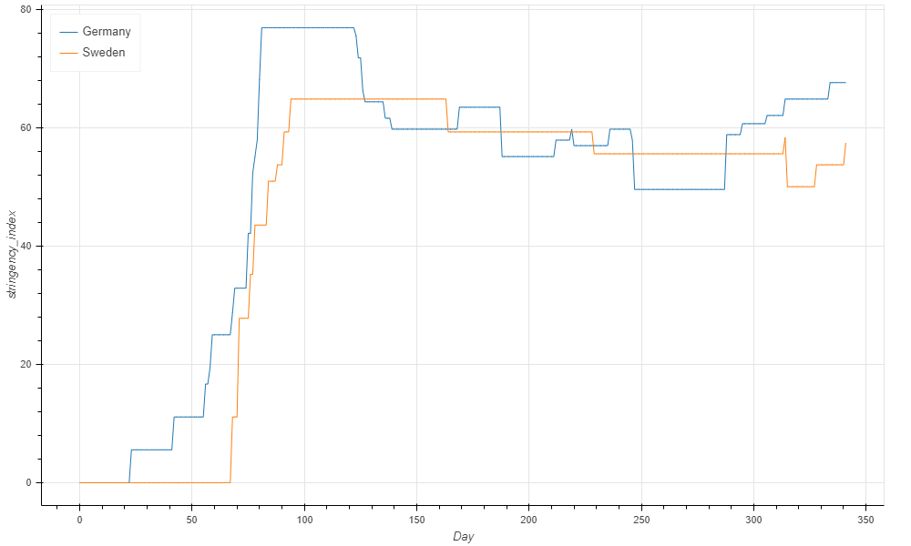
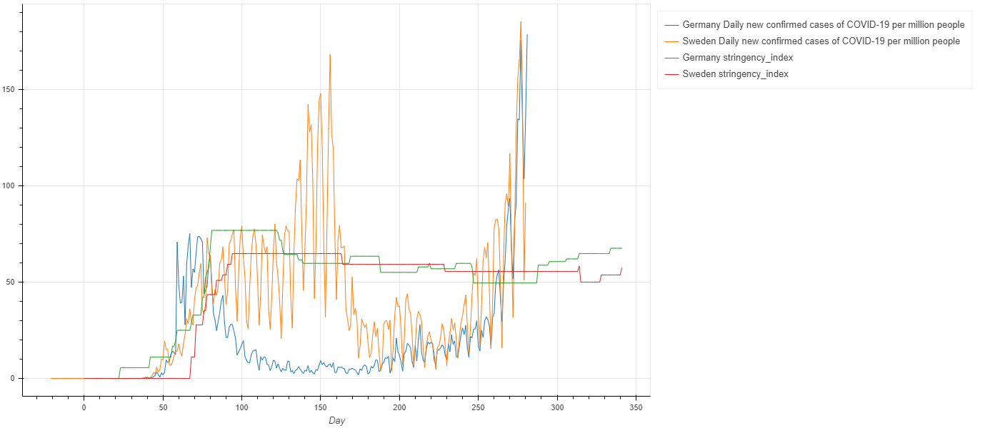

# owid-grapher
My simple and tweaked and customized scripts to process and plot COVID-19 data from the [OWID (Our World In Data) datasets](https://github.com/owid/owid-datasets).

Currently tested on the COVID data sets.

###### Usage:
Run `git submodule update --init --depth=1` to initialize and get latest owid-datasets.
Run `python3 grapher.py -h` to see options.

###### Sample usage:
`python3 grapher.py --list-datasets` will list datasets. By default it filters only datasets with the keyword `covid` in their name.

Output:
```
0. COVID testing time series data
1. COVID-19 Tests
2. COVID-2019 - Hospital & ICU
3. COVID-19 - Johns Hopkins University
4. COVID-2019 - ECDC (2020)
5. COVID Government Response (OxBSG)
6. COVID-19 Tests per million people
```

We want to see the number of daily deaths from COVID-19 per million people in Germany and Sweden and compare it with some Government Response criteria.

Let's print available columns in datasets `COVID-2019 - ECDC (2020)` and `COVID Government Response (OxBSG)`.

`python3 grapher.py --datasets 4 5 --col-names`

Output:
```
0. Country
1. Day
2. Daily new confirmed cases of COVID-19
...
6. Daily new confirmed cases of COVID-19 per million people
...
64. stringency_index
...
73. vaccination_policy
```

Now we want to graph columns:
- 6 - Daily new confirmed cases of COVID-19 per million people
- 64 - stringency_index

for Germany and Sweden.

`python3 grapher.py --datasets 4 5 --countries Germany Sweden --columns 6 64`

By default each column is in a new graph.
We can also choose to plot all columns in a single graph.

`python3 grapher.py --datasets 4 5 --countries Germany Sweden --columns 6 64 --no-subplots`

The graph will be saved as html file with [bokeh](https://bokeh.org) plots.
Output filename can be automatically prepared from arguments. In this case:
`output file: out/Germany_Sweden_Daily_new_confirmed_cases_of_COVID_19_per_million_people_stringency_index_per_Country_Day.html`

##### Sample Output:

Each column is in a new sub plot.
<a href="https://gil-mor.github.io/owid-grapher/sample-plot-subplots.html" target='_blank'>
    
    
</a>

All columns are in the same plot.
<a href="https://gil-mor.github.io/owid-grapher/sample-plot-single-plot.html" target='_blank'>
    
</a>

### Requires
python3 pandas, bokeh
